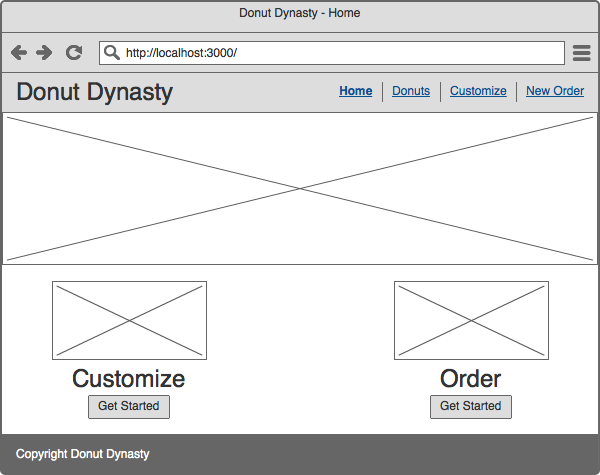
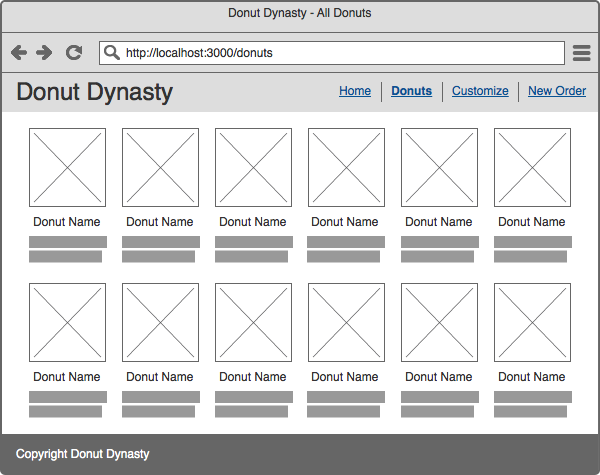
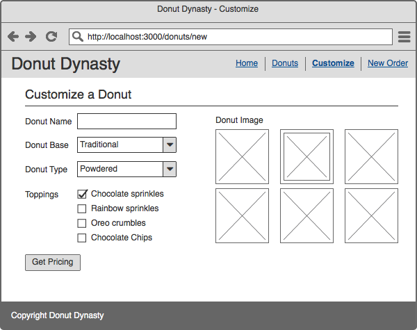
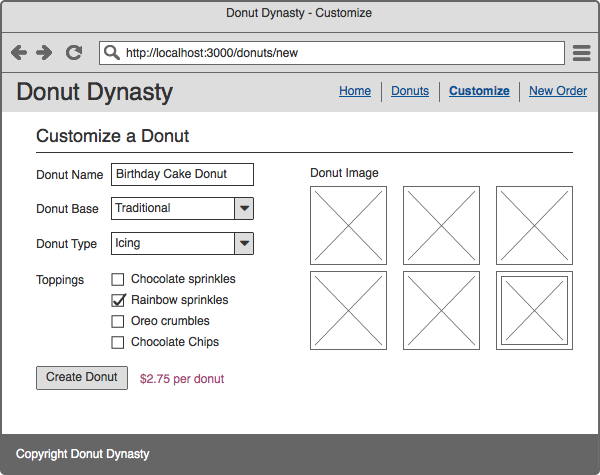
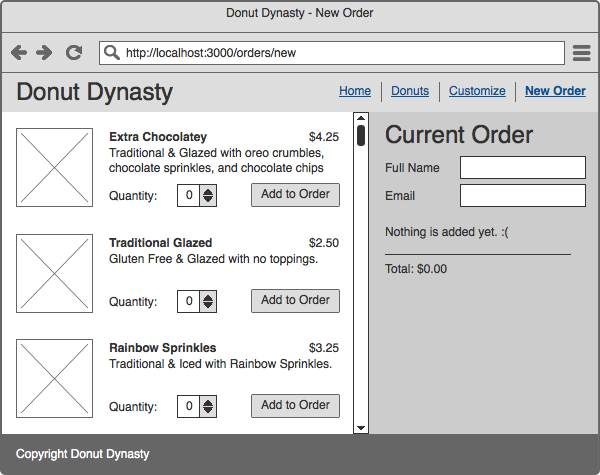
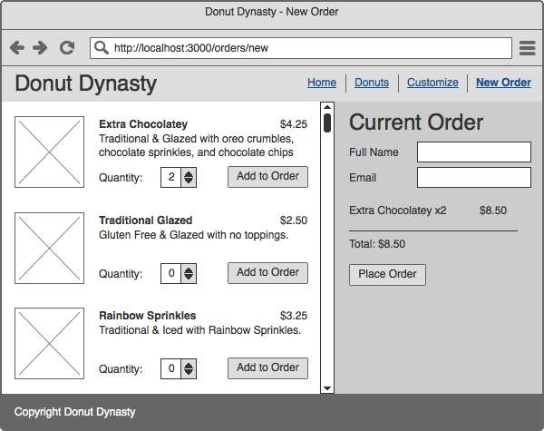
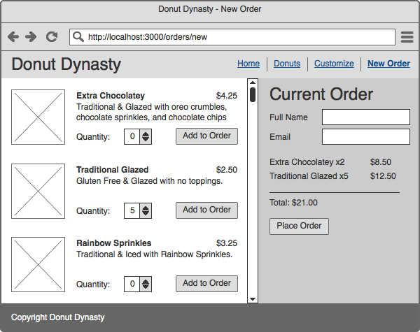
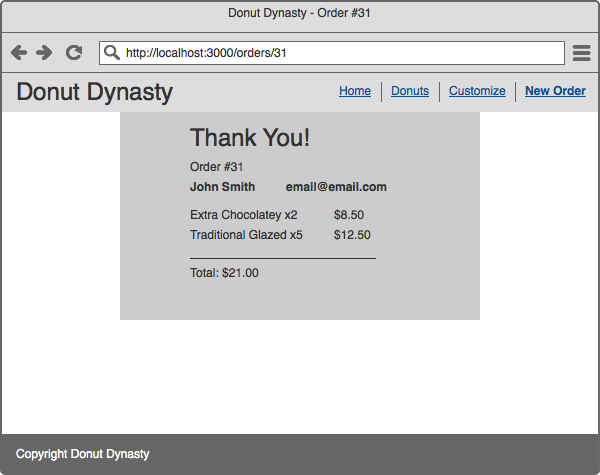

## Donut Dynasty

You'll be building a full stack application for a new company that creates and ships custom donuts. This project is designed to take 2+ days and is designed to allow for plenty of creativity.

The main objective is to:

```
Create a full stack CRUD application
that contains multiple, connected tables
and serves HTML from the server side
and responds to AJAX requests from the client
```

## Requirements

Project requirements are kept on this [public Trello Board](https://trello.com/b/EGiwONfD/g48-donut-dynasty-full-stack-project) which you can duplicate. To copy it, click the *Show Menu* button on the top right, then click *More*, and finally *Copy Board*.

In addition, you should:

1. Create an ERD with a tool like [draw.io](https://draw.io) and include the image in your final repository

1. Deploy your site

## Mockups

While the above mentioned Trello board will take you through the project details, there are also mockups which showcase how the site is intended to be used.

**Home**



**All Donuts**



**Customize (New Donut)**





**Place Order (New Order)**








